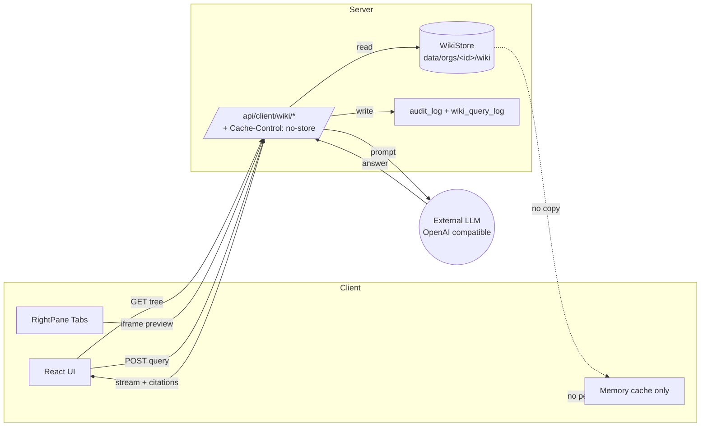

# GE-paw 架构设计

> v4，2026-06-08。配套 README_zh.md。

## 1. 设计原则

1. **单一后端**：一个 `gepaw serve` 进程同时承载 HTTP API、APScheduler、Channel 监听器。Tauri 桌面壳把 `gepaw serve` 作为 sidecar 启动。
2. **服务端权威**：LLM 端点、Skill、MCP、Plugin、Channel、Cron 全部由组织管理员配置，终端用户**不自助开关**；system-prompt 由后端拼装注入 `react_agent`，客户端不可改写。
3. **客户端零落盘**：问答模式语料全在服务端，客户端进程不下载、不缓存、不持久化。
4. **LLM 协议统一**：强制 OpenAI 兼容协议，删除其他 provider 实现。
5. **可观测**：所有 admin 写操作落 `audit_log`；LLM 调用写 `token_usage_log`；cron 写 `cron_run`；wiki 写 `wiki_query_log`。

## 2. 双产品线

### 2.1 助手模式 (Assistant Mode)

```
+-------------------+        +-----------------------+
|  IM 渠道          |        |  Web 控制台 / Tauri   |
|  (telegram/feishu |        |  (Codex 风格)         |
|   /wecom/...)     |        |                       |
+---------+---------+        +-----------+-----------+
          |                               |
          | /api/webhook/<kind>           | /api/client/chat
          | (签名校验)                    | (JWT bearer)
          v                               v
+---------------------------------------------+
|  gepaw.channels.manager                     |
|  - kind 注册表（来自 QwenPaw 子项目）        |
|  - unified_queue_manager 速率限制 / 重试     |
+---------------------+-----------------------+
                      |
                      v
            +------------------+
            |  react_agent     |
            |  (system: org +  |
            |   enabled skill) |
            +---------+--------+
                      |
                      v
        +-------------+--------------+
        |  LLM Endpoint (OpenAI 兼容) |
        +----------------------------+
```

* **频道接入**：`channel_account` 存凭据（Fernet 加密）→ 启动时按 `kind` 加载对应的 listener → 收到消息后路由到 `react_agent` → 产出回发到 IM。
* **会话管理**：`chat_session` 时间线 + 搜索 + 置顶 + 重命名 + 删除 + 导出；跨渠道策略默认「渠道隔离」，org 维度可切「跨渠道合并」 (`org.cross_channel_merge`)。
* **Cron**：`APScheduler` 加载 `cron_job` 表；输出可写会话、推 IM、仅审计；连续 3 次失败自动禁用并写 `audit_log`。
* **Token 计量**：`model_wrapper.py` 拦截 → 写入 `token_usage_log`（含 prompt / completion / total）→ `buffer.py` 聚合落库 → `/api/admin/tokens/summary` 图表；费率在 `/api/admin/tokens/cost_table` 配置；org 维度月度上限可选。
* **Skill / MCP / Plugin**：`/api/client/config` 仅下发 `enabled=True` 的项；后端拼装 system-prompt，**客户端即便手动改也由后端覆盖**。

### 2.2 问答模式 (Q&A / Wiki Mode)

> 语料**只在服务端**，客户端零落盘。

```
                     +-----------------------------+
                     |  Admin browser              |
                     |  /admin/wiki                |
                     |  - upload                   |
                     |  - trigger ingest / compile |
                     |  - view sources / entities  |
                     +--------------+--------------+
                                    |
                                    v
+----------+   POST /api/admin/wiki/sources/upload  +------------------+
|  upload  | ----------------------------------------> |  WikiStore (fs) |
+----------+                                           |  data/orgs/<id>/ |
                                                       |   wiki/raw/      |
                                                       +------------------+
                                                                 |
                                                                 v
                                                       +------------------+
                                                       |  pipeline.ingest |
                                                       |  - markitdown    |
                                                       |  - frontmatter   |
                                                       |  - write wiki/   |
                                                       +------------------+
                                                                 |
                                                                 v
                                                       +------------------+
                                                       |  pipeline.compile|
                                                       |  - index.md      |
                                                       |  - overview.md   |
                                                       +------------------+

+----------+  GET /api/client/wiki/tree   (Cache-Control: no-store)
|  Client  | ------------------------------------------------------+
|  Browser |  GET /api/client/wiki/preview (markdown + bleach)       |
|  /Tauri  |  POST /api/client/wiki/query  (SSE stream + citations)  |
+----------+                                                           |
       ^                                                                |
       |                                                                |
       +----------------------------------------------------------------+
              强制 Cache-Control: no-store
              raw/ 与 graph/ 路径 403
              跨 org 403
```

**关键点**：

* **数据层边界**：
  * 资产：`raw/` (源文件)、`wiki/` (整编后的 markdown + overview)、`graph/` (实体 / 关系图)、`wiki_source` 表、`wiki_query_log` 表——**全部在服务端**。
  * 客户端看到的只是 `wiki/` 子树，且通过 `Cache-Control: no-store` 阻止浏览器持久化。
* **检索**：md 全文子串 + 标题加权 + top-k=5 + LLM 合成回答（与 `llm-wiki-agent` 原始方法一致，**不引入向量数据库**）。
* **后端存储抽象**：`WikiStore` 抽象，v1 实现 `FilesystemWikiStore`；v2 可替换 `S3WikiStore` / `OSSWikiStore` 而不动上层代码。

## 2.1.1 助手模式 — Token 计量与渠道驱动

助手模式的三件核心能力 (cron / 频道 / token) 现在已经全部跑通：

- **Token 计量**：每一次 LLM 调用 (chat / chat_stream / cron / 渠道 / 问答) 都会被 `gepaw.token_usage.record_usage` 拦截，按 org / user / session / model / tokens_in / tokens_out / cost_cents 写入 `token_usage_log`。成本根据 `cost_table` 计算，支持管理员覆盖。
- **Channel 监听器**：`gepaw.app.channels.manager` 在 FastAPI 启动时拉起所有 enabled 的 `channel_account`，每个账号运行一个独立线程，绑定 `IncomingHandler`，后者自动从历史消息 + 用户消息构建 history、调用 LLM、把 assistant 回复写入 `message` 表。Webhook 接口 `POST /api/webhook/<kind>` 允许外部 IM 服务或本地测试脚本注入消息。
- **Cron 调度**：`gepaw.app.scheduler` 维护一个 APScheduler 实例，按 `cron_job.schedule_cron` 调度 `_execute_cron`，连续失败 3 次自动禁用并写 audit。
## 3. 控制台：Codex 风格三栏 + 右侧多 Tab

### 3.1 整体布局

```
+-----------+--------------------------------+----------------+
| LeftPane  | Center (Assistant / QnA)       | RightPane      |
| (240px)   |                                | (420px, fold)  |
|           |                                |                |
| new chat  |  +--------------------+        | +Tabs+ +----+  |
| mode swt  |  | msg / input         |       | | F W | |X  ||  |
| timeline  |  +--------------------+        | +----+ +----+  |
| admin grp |  | stream / citations  |       | Files/Web/    |
|           |  +--------------------+        | Diff/Pre/Plan |
+-----------+--------------------------------+----------------+
+-- Top bar: org switch, model status, token mini, theme ---------+
```

* 左栏可折 48px，右栏可折 0；中部最小宽 640px。
* 快捷键：`Ctrl+B` 折左栏、`Ctrl+J` 折右栏、`Ctrl+1..9` 切右栏 Tab、`Ctrl+Shift+T` 关当前 Tab、`Ctrl+K` 命令面板（v2）。
* 暗 / 亮双主题；统一字体、圆角 4–6px、行高 1.55。

### 3.2 右侧 Tab 容器

`web/src/components/RightPane/`

* `RightPane.tsx`：Tab 容器 + Ctrl+1..9 切换 + Ctrl+Shift+T 关闭。
* `registry.ts`：Tab 注册表（id / title / component / icon / supportsDataSource）。
* v1 已启用：
  * **FilesTab**：`dataSource` 切换「local（助手工作区）」/「wiki（问答语料）」。两种模式共享同一组件。
  * **WebTab**：iframe + 地址栏 + 强 `sandbox`。
* v1 占位（Coming soon）：
  * **DiffTab**（对比 wiki 源文件版本、对话产物）
  * **PreviewTab**（多格式预览，问答模式底层走 `wiki/preview`）
  * **PlanTab**（react_agent 任务拆解/进度）

### 3.3 Files / Web 在两种模式下的数据源

| Tab   | 助手模式                              | 问答模式                                |
|-------|--------------------------------------|----------------------------------------|
| Files | 本地工作区 (`/api/client/fs/list`)    | 服务端 wiki 树 (`/api/client/wiki/tree`) |
| Web   | 任意 URL（受 `web_allowlist` 限制）   | 默认渲染 `/api/client/wiki/preview`    |

`/api/client/wiki/*` 由 `WikiNoStoreMiddleware` 强制注入 `Cache-Control: no-store`。

## 4. 客户端-服务端边界（Mermaid）



**实线**是允许的请求-响应。**虚线**表示**禁止**的方向：服务端语料不复制到客户端内存，客户端不持久化。

## 5. 数据模型

完整表清单（`src/gepaw/models/`）：

* `identity.py`：`org`、`user`、`membership`、`refresh_token`
* `llm.py`：`llm_endpoint`、`skill`、`mcp_server`、`plugin`
* `assistant.py`：`chat_session`、`message`、`channel_account`、`cron_job`、`cron_run`、`token_usage_log`
* `wiki.py`：`wiki_corpus`、`wiki_source`、`wiki_query_log`
* `audit.py`：`audit_log`

敏感字段统一用 `Fernet(SHA256(GEPAW_SECRET_KEY))` 加密。

## 6. 中间件 / 异常映射

* `CORSMiddleware`：按 `GEPAW_CORS_ORIGINS` 配置
* `WikiNoStoreMiddleware`：对 `/api/client/wiki` 与 `/api/admin/wiki` 注入 `Cache-Control: no-store`
* 全局异常 handler：
  * `PermissionError` → 403
  * `FileNotFoundError` → 404
  * 其它 → 500（`{"detail":"internal_error","message": ...}`）

## 7. 默认与可调项（v1）

| 项 | 默认 | 环境变量 |
|----|------|---------|
| 监听端口 | 8765 | `GEPAW_PORT` (CLI) |
| 数据库 | SQLite `./data/gepaw.db` | `GEPAW_DATABASE_URL` |
| 数据目录 | `./data` | `GEPAW_DATA_DIR` |
| CORS origins | 仅同源 | `GEPAW_CORS_ORIGINS` |
| Access TTL | 15 min | `GEPAW_ACCESS_TTL` |
| Refresh TTL | 7 d | `GEPAW_REFRESH_TTL` |
| LLM timeout | 120 s | `GEPAW_LLM_TIMEOUT` |
| Wiki file max | 1 MiB | `GEPAW_WIKI_MAX_BYTES` |
| Wiki preview max | 2 MiB | `GEPAW_WIKI_PREVIEW_MAX_BYTES` |
| Cron 失败阈值 | 3 | `CRON_FAILURE_DISABLE_THRESHOLD`（代码常量） |
| 跨渠道合并 | 关（隔离） | `org.cross_channel_merge`（v2） |

## 8. 不在 v1 范围

跨组织联邦、企业 SSO、外部计费、向量检索、移动端、插件市场自动发布、Tauri 多语言安装器、tunnel 远端通道、客户端离线缓存。
