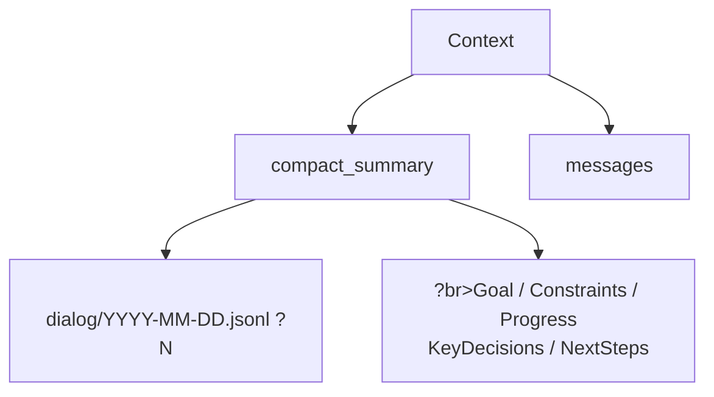

# Context Management?

## 

LLM ?*?* ?..

**?*?" AI ?

>  [OpenClaw](https://github.com/openclaw/openclaw)  gepaw ?**LightContextManager** ?

###  ?

gepaw  Offload 

|                  |               | Offload               | ?                  |
| -------------------- | --------------------- | ------------------------- | ------------------------------------ |
| ** Offload** | ? | `tool_result/{uuid}.txt`  |  +                   |
| ** + **  | ?Token ?| `dialog/YYYY-MM-DD.jsonl` | `compact_summary`?+ ?|

**?*`MemoryCompactionHook` 

```mermaid
flowchart LR
    A[] --> B[1  Offload]
    B --> C[2 Token ]
    C -->|| D[]
    C -->|| E[3 \n compact_summary]
    E --> F[4 \n dialog/]
    F --> D
```

- **?* `dialog/` `tool_result/`Agent  `read_file` 
- ****`compact_summary` ?+ ?Agent 
- **** `/compact` 

## ?

### 

gepaw ?



|                 |                                                      |
| ------------------- | -------------------------------------------------------- |
| **compact_summary** |                          |
| ?      |  `dialog/YYYY-MM-DD.jsonl`   |
| ??   | Goal / Constraints / Progress / KeyDecisions / NextSteps |
| **messages**        | ?                          |

### 

?Offload 

|                       |                                       |
| ------------------------- | ----------------------------------------- |
| `dialog/YYYY-MM-DD.jsonl` |   |
| `tool_result/{uuid}.txt`  | ?N  |

### 

```mermaid
graph LR
    A[<br>System Prompt] -->|| B[<br>Compactable Messages]
    B -->|| C[?br>Recent Messages]
```

|          |                       |                      |
| ------------ | ------------------------- | ---------------------------- |
| **** | AI ?" | ?          |
| **** |               | Token ?|
| **?*   | ?N ?            |      |

### 

```
?
?System Prompt ()                     ? ?
?"?AI ..."                     ?
?
?compact_summary (?                   ? ??
? - [] dialog/2025-01-15.jsonl?
? - Goal:                  ?
? - Progress: ?..            ?
?
?                                 ? ??
?[1] :              ?
?[2] : ?..            ?
?[3] ...                   ?
?...                                      ?
?
??                                  ? ?
?[N-2] : ?            ?
?[N-1] : ...                   ?
?[N] : ?                     ?
?
```

## 

### 

```mermaid
graph LR
    Agent[Agent] -->|| Hook[MemoryCompactionHook]
    Hook --> TC[compact_tool_result<br>]
    TC --> CC[check_context<br>Token ]
    CC -->|| CM[compact_memory<br>]
```

### 

- [LightContextManager](https://github.com/agentscope-ai/gepaw/blob/main/src/gepaw/agents/context/light_context_manager.py)
- [AsMsgHandler](https://github.com/agentscope-ai/gepaw/blob/main/src/gepaw/agents/context/as_msg_handler.py) ??
- [compactor_prompts](https://github.com/agentscope-ai/gepaw/blob/main/src/gepaw/agents/context/compactor_prompts.py) ??

### 

```mermaid
flowchart LR
    M[messages] --> TC[ToolCallResultCompact<br>Offload ]
    TC --> CC[ContextChecker<br>Token ]
    CC --> D{Token > ?}
    D -->|| K[]
    D -->|| E[?X% tokens]
    E --> CM[Compactor<br>]
    CM --> SD[SaveDialog<br>Offload <br>dialog/YYYY-MM-DD.jsonl]
    SD --> R[ compact_summary + ]
```

****?

1. `ToolCallResultCompact` ? Offload ?`tool_result/`
2. `ContextChecker` ? Token 
3. `Compactor` ?`compact_memory`?
4. `SaveDialog` ??`dialog/YYYY-MM-DD.jsonl`

## 

gepaw ?

### 1. compact_tool_result ?

?`tool_result_pruning_config.enabled` ?`true`

```mermaid
flowchart LR
    A[Tool Call Result] --> B{?pruning_recent_n ?}
    B -->|| C[?br>pruning_recent_msg_max_bytes<br>?tool_result/uuid.txt<br>?+ ]
    B -->|| D[?br>pruning_old_msg_max_bytes<br><br>]
    C --> E[Context]
    D --> E
```

|                    | ?                          | ? |                            |
| -------------------------- | ------------------------------ | ------- | ------------------------------ |
| ?`pruning_recent_n` ?| `pruning_recent_msg_max_bytes` | `50000` | ?|
| ?                | `pruning_old_msg_max_bytes`    | `3000`  |  |

**?*

- **Browser Use ?* `tool_result/uuid.txt` +  N  `pruning_recent_n` ?
- **read_file **`pruning_recent_n`  `tool_result/`
-  `offload_retention_days` 

### 2. check_context ??

 Token ?

```mermaid
graph LR
    M[messages] --> H[Token ]
    H --> C{total > threshold?}
    C -->|| K[]
    C -->|| S[?br>reserve tokens]
    S --> CP[messages_to_compact<br>]
    S --> KP[messages_to_keep<br>]
    S --> V{is_valid<br>?}
```

- **** `memory_compact_reserve` tokens?
- **?* user-assistant ?tool_use/tool_result 

### 3. compact_memory ?

 ReActAgent ****?

```mermaid
graph LR
    M[messages] --> H[format_msgs_to_str]
    H --> A[ReActAgent<br>reme_compactor]
    P[previous_summary] -->|| A
    A --> S[]
```

### 4. ?compact ?

?

```
/compact
```


```
/compact 
```


```
**Compact Complete!**

- Messages compacted: 12
**Compressed Summary:**
<>
```

?

-  **Messages compacted** - 
-  **Compressed Summary** - ?

## 

`compact_summary` ?*** + **?*?

### 

 `dialog/YYYY-MM-DD.jsonl` Agent  `read_file` ?

### ?

```mermaid
graph TB
    A[] --> B[Goal]
    A --> C[Constraints]
    A --> D[Progress]
    A --> E[Key Decisions]
    A --> F[Next Steps]
    A --> G[Critical Context]
```

|                  |                    |                                     |
| -------------------- | ---------------------- | --------------------------------------- |
| **Goal**             |                | "?                  |
| **Constraints**      | ?            | " TypeScript"       |
| **Progress**         | /??| "?        |
| **Key Decisions**    | ?        | " JWT  Session? |
| **Next Steps**       | ?        | ""                      |
| **Critical Context** | ?    | " src/auth.ts"                  |

- ****?`previous_summary` 
- ****

## 

 `~/.gepaw/workspaces/{agent_id}/agent.json`  `running` ?

**`running` ?*

|                       | ?       |                          |
| ------------------------- | ------------- | ---------------------------- |
| `max_input_length`        | `131072`      | tokens?|
| `context_manager_backend` | `"light"`     |          |
| `memory_manager_backend`  | `"remelight"` | ?          |

**`running.light_context_config` ?*

|                            | ?    |                              |
| ------------------------------ | ---------- | -------------------------------- |
| `dialog_path`                  | `"dialog"` |  |
| `token_count_estimate_divisor` | `4.0`      | ?token         |

**`running.light_context_config.context_compact_config` ?*

|                           | ?|                                                              |
| ----------------------------- | ------ | ---------------------------------------------------------------- |
| `enabled`                     | `true` | ?                                          |
| `compact_threshold_ratio`     | `0.8`  |  `max_input_length * ratio` ?      |
| `reserve_threshold_ratio`     | `0.1`  |  `max_input_length * ratio` tokens |
| `compact_with_thinking_block` | `true` | ?thinking block                                    |

**`running.light_context_config.tool_result_pruning_config` ?*

|                            | ? |                                              |
| ------------------------------ | ------- | ------------------------------------------------ |
| `enabled`                      | `true`  |                              |
| `pruning_recent_n`             | `2`     | ?N ?                       |
| `pruning_old_msg_max_bytes`    | `3000`  | ?                        |
| `pruning_recent_msg_max_bytes` | `50000` | ?`pruning_recent_n` ?|
| `offload_retention_days`       | `5`     | ?      |

**?*

- `memory_compact_threshold` = `max_input_length  compact_threshold_ratio`
- `memory_compact_reserve` = `max_input_length  reserve_threshold_ratio`?tokens?

**?*

```json
{
  "agents": {
    "running": {
      "max_input_length": 128000,
      "context_manager_backend": "light",
      "light_context_config": {
        "dialog_path": "dialog",
        "context_compact_config": {
          "enabled": true,
          "compact_threshold_ratio": 0.8,
          "reserve_threshold_ratio": 0.1
        },
        "tool_result_pruning_config": {
          "enabled": true,
          "pruning_recent_n": 2,
          "pruning_old_msg_max_bytes": 3000,
          "pruning_recent_msg_max_bytes": 50000
        }
      }
    }
  }
}
```
